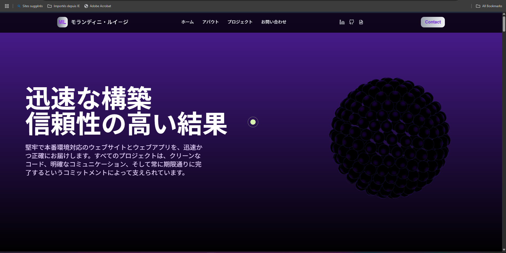

# 3D Portfolio

A modern, animated and interactive 3D portfolio with Japanese localization, featuring smooth GSAP animations, custom cursor effects, and responsive design.



## Features

- 🌟 **Hero Section** with 3D Spline animations
- 🎯 **Custom Animated Cursor** (desktop only) with GSAP
- 📱 **Responsive Design** with mobile-friendly navigation
- 🎨 **Smooth Animations** using Framer Motion and GSAP ScrollTrigger
- 🌐 **Japanese Localization** (日本語対応)
- 📧 **Contact Form Modal** with animated interactions
- 🖼️ **Projects Section** with horizontal scrolling gallery
- ⭐ **About Section** with parallax star animations
- 🎪 **Contact Section** with circular zoom animation effect
- 📱 **Mobile Menu** with slide-in animation

## Tech Stack

- [React](https://react.dev/) - UI library
- [Vite](https://vitejs.dev/) - Build tool and dev server
- [Framer Motion](https://www.framer.com/motion/) - Animation library
- [GSAP](https://gsap.com/) - Professional animation library with ScrollTrigger
- [Tailwind CSS](https://tailwindcss.com/) - Utility-first CSS framework
- [Spline](https://spline.design/) - 3D design and animation
- [React Icons](https://react-icons.github.io/react-icons/) - Icon library

## Getting Started

1. **Install dependencies:**
   ```bash
   npm install
   ```

2. **Start the development server:**
   ```bash
   npm run dev
   ```

3. **Open your browser:**
   Visit [http://localhost:5173](http://localhost:5173) to view the app.

## Project Structure

```
src/
├── components/
│   ├── Header.jsx              # Navigation header with contact form
│   ├── HeroSection.jsx         # Landing section with 3D Spline animation
│   ├── AboutSection.jsx        # About section with parallax stars
│   ├── ProjectsSection.jsx     # Horizontal scrolling project gallery
│   ├── ContactSection.jsx      # Circular zoom contact animation
│   └── CustomCursor.jsx        # Custom animated cursor component
├── assets/                     # Static assets (images, icons)
├── index.css                   # Tailwind and global styles
└── main.jsx                    # App entry point
```

## Key Components

### Header
- Animated navigation with Japanese text
- Social media links (LinkedIn, GitHub, CV)
- Contact form modal with form validation
- Mobile hamburger menu

### HeroSection
- 3D Spline animation integration
- Animated typography with spring animations
- Responsive layout for all devices

### AboutSection
- Parallax scrolling star animations
- Animated title and description
- Profile image with blend modes

### ProjectsSection
- Horizontal scrolling gallery
- Project image animations on scroll
- Responsive grid layout

### ContactSection
- Circular zoom animation effect
- ScrollTrigger-based interactions
- Smooth transitions between states

### CustomCursor
- GSAP-powered cursor animation
- Mobile detection and hiding
- Mouse interaction effects

## Animation Libraries Used

- **Framer Motion**: Component animations, page transitions, modal animations
- **GSAP**: Custom cursor, scroll-triggered animations, timeline animations
- **ScrollTrigger**: Scroll-based animations, parallax effects, pinning

## Credits

Created by **Yukikaze-coder**

## License

This project is open source and available under the [MIT License](LICENSE).


